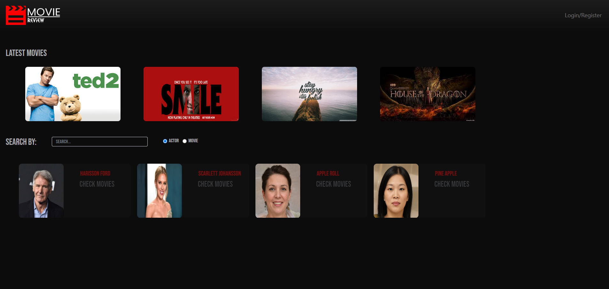
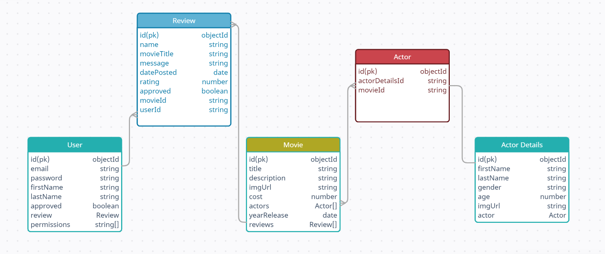

# MOVIE-REVIEW -> PLEASE CLICK LINKS FOR FRONTEND & BACKEND SERVICES

LINKS:

FRONTEND: https://github.com/nanotechkarl/streaming-app

BACKEND: https://github.com/nanotechkarl/streaming-service

A collection of movies with reviews from people.

# Technologies used:

- React - Typescript
- HTML - SCSS
- Redux Toolkit
- Loopback 4
- MongoDB
- Sonarqube
- React Testing Library + Jest

# Features

- View movies together with their actors and reviews(Public)
- Give reviews and ratings to movies(User only)
- Add movies and actors using the dashboard page(Admin only)

# Models

This app has the following models:

- User - a model representing the users of the app.
- Movie - a model representing the movies of the app.
- Actor - a model representing the connection between the movies and the actors.
- Actor Details - a model representing the details of an actor
- Review - a model representing the reviews of a user to a movie.
